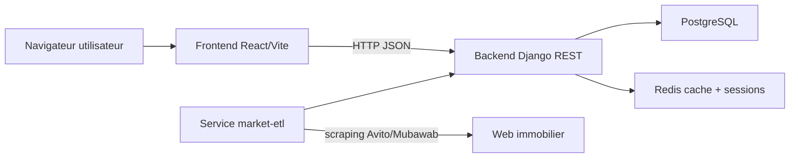
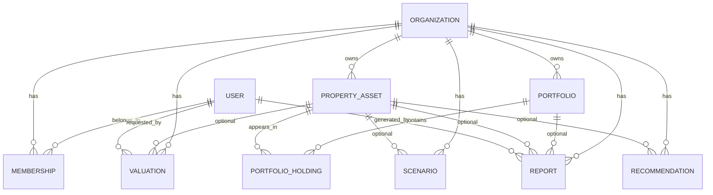
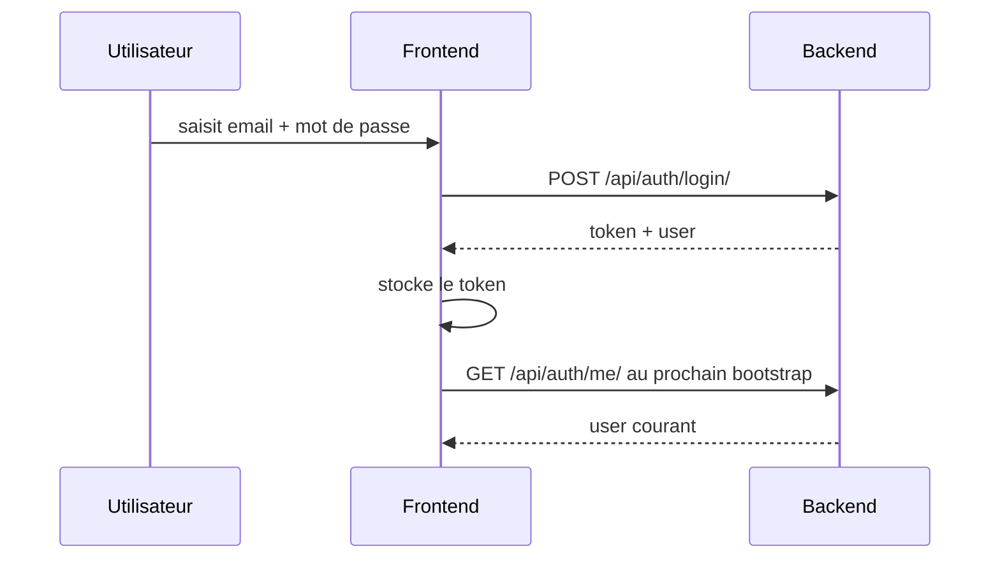
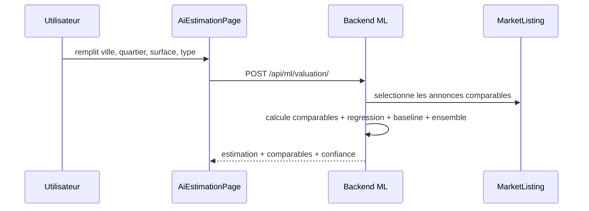
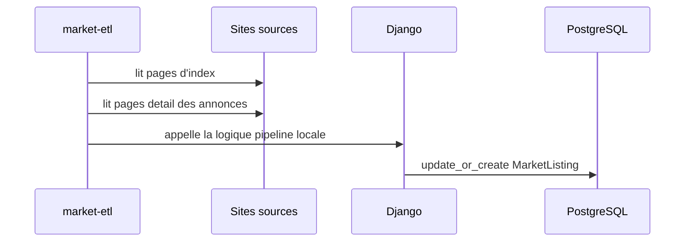

# Documentation Technique SmartEstate

Etat observe dans le depot le 2026-06-02.

Ce document decrit l'application telle qu'elle existe dans le code, pas telle qu'elle est seulement souhaitee cote produit. Il couvre l'architecture, les modules, les flux, la couche donnees, les routes frontend, les endpoints backend, l'ETL marche, la couche ML et les points d'attention techniques.

## 1. Vue d'ensemble

SmartEstate est une application web immobiliere composee de :

- un frontend React + TypeScript + Vite dans `frontend/`
- un backend Django REST dans `backend/`
- une base PostgreSQL
- un cache Redis
- un service ETL de collecte d'annonces de marche

Le produit couvre 3 parcours principaux :

- `UTILISATEUR_SIMPLE` : estimation, recommandations, consultation du marche, simulation simple, historique, profil
- `AGENT_IMMOBILIER` : dashboard, statistiques, estimation pro, gestion d'annonces et demandes clients
- `ADMINISTRATEUR` : dashboard global, gestion des utilisateurs, gestion des agents, suivi donnees et pages d'administration

Le projet melange aujourd'hui deux niveaux de maturite :

- des ecrans relies au backend et a de vraies donnees
- des ecrans encore au stade maquette interactive locale, sans persistance

## 2. Structure du depot

```text
App/
|-- README.md
|-- docker-compose.yml
|-- .env.managed.example
|-- backend/
|   |-- manage.py
|   |-- requirements.txt
|   |-- Dockerfile
|   |-- README.md
|   |-- smartestate_backend/
|   |-- apps/
|       |-- accounts/
|       |-- organizations/
|       |-- properties/
|       |-- portfolios/
|       |-- intelligence/
|-- frontend/
|   |-- package.json
|   |-- Dockerfile
|   |-- index.html
|   |-- vite.config.ts
|   |-- src/
|       |-- App.tsx
|       |-- auth/
|       |-- components/
|       |-- data/
|       |-- hooks/
|       |-- lib/
|       |-- pages/
|       |-- styles.css
|-- docs/
|   |-- DOCUMENTATION_TECHNIQUE.md
```

## 3. Architecture globale



## 4. Execution et infrastructure

### 4.1 Services Docker

`docker-compose.yml` declare 5 services :

- `backend` : serveur Django expose sur `8000`
- `market-etl` : processus de scraping en boucle
- `frontend` : serveur Vite expose sur `5173`
- `postgres` : PostgreSQL 16
- `redis` : Redis 7

Ports exposes :

- frontend : `5173`
- backend : `8000`
- postgres : `5432`
- redis : `6379`

### 4.2 Deux modes de configuration

Le backend supporte deux modes principaux :

- mode local : PostgreSQL/Redis locaux, avec `backend/.env.local.example`
- mode services manages : DB et Redis distants, avec `backend/.env.example` ou `backend/.env.managed.example`

Le fichier racine `.env.managed.example` sert a piloter Docker Compose contre des services distants.

### 4.3 Variables importantes

Variables backend :

- `DJANGO_SECRET_KEY`
- `DJANGO_DEBUG`
- `DJANGO_ALLOWED_HOSTS`
- `DJANGO_CORS_ALLOWED_ORIGINS`
- `DJANGO_CSRF_TRUSTED_ORIGINS`
- `SMARTESTATE_PUBLIC_DEMO_ACCESS`
- `SMARTESTATE_USE_MANAGED_SERVICES`
- `DATABASE_FALLBACK_TO_SQLITE`
- `DATABASE_SSL_REQUIRE`
- `DATABASE_CONN_MAX_AGE`
- `DATABASE_URL`
- `REDIS_URL`
- `CELERY_BROKER_URL`

Variables frontend :

- `VITE_APP_NAME`
- `VITE_API_BASE_URL`
- `VITE_PUBLIC_DEMO_ACCESS`

## 5. Backend Django REST

### 5.1 Stack backend

Le backend repose sur un socle volontairement leger :

- Django 5
- Django REST Framework
- Token Authentication DRF
- `dj-database-url` pour parser `DATABASE_URL`
- `django-redis` pour Redis

Fait notable :

- aucune dependance Celery n'est presente, meme si `CELERY_BROKER_URL` est defini
- aucune dependance ML lourde n'est presente
- aucune dependance de scraping tierce n'est presente

Les algorithmes ML et le scraping sont implementes en Python "pur".

### 5.2 Points d'entree backend

Fichiers clefs :

- `backend/manage.py` : point d'entree Django
- `backend/smartestate_backend/settings.py` : configuration
- `backend/smartestate_backend/urls.py` : routage API
- `backend/smartestate_backend/health.py` : healthcheck DB/cache
- `backend/smartestate_backend/access.py` : regles de visibilite des organisations
- `backend/smartestate_backend/model_mixins.py` : mixin `created_at` / `updated_at`

### 5.3 Configuration runtime

Points importants de `settings.py` :

- le backend charge manuellement `backend/.env`
- la DB privilegie `DATABASE_URL`
- un fallback SQLite existe seulement si `DATABASE_FALLBACK_TO_SQLITE=True`
- Redis est obligatoire si `SMARTESTATE_USE_MANAGED_SERVICES=True`
- `AUTH_USER_MODEL` pointe vers `accounts.User`
- l'API active `TokenAuthentication` et `SessionAuthentication`
- la permission DRF par defaut devient `AllowAny` si `SMARTESTATE_PUBLIC_DEMO_ACCESS=True`, sinon `IsAuthenticated`

### 5.4 Applications backend

| App | Responsabilite principale | Fichiers clefs |
|---|---|---|
| `apps.accounts` | utilisateur, roles, inscription, login, admin users | `models.py`, `serializers.py`, `views.py`, `permissions.py` |
| `apps.organizations` | organisations et membres | `models.py`, `serializers.py`, `views.py` |
| `apps.properties` | actifs internes + annonces ETL du marche | `models.py`, `views.py`, `etl/`, `management/commands/` |
| `apps.portfolios` | portefeuilles et holdings | `models.py`, `serializers.py`, `views.py` |
| `apps.intelligence` | scenarios, valuations, recommandations, rapports, dashboard, ML | `models.py`, `serializers.py`, `views.py`, `ml/algorithms.py` |

### 5.5 Modele de donnees

#### 5.5.1 Entites principales

| Entite | Description |
|---|---|
| `User` | utilisateur sans `username`, identifie par email, avec role metier |
| `Organization` | organisation immobiliere visible selon le role |
| `Membership` | lien user <-> organization avec role de membre |
| `PropertyAsset` | actif immobilier interne gere par la plateforme |
| `MarketListing` | annonce de marche importee depuis Avito ou Mubawab |
| `Portfolio` | portefeuille immobilier rattache a une organisation |
| `PortfolioHolding` | affectation d'un actif dans un portefeuille |
| `Scenario` | scenario d'investissement sauvegarde |
| `Valuation` | estimation de valeur sauvegardee |
| `Recommendation` | recommandation metier / IA |
| `Report` | rapport rattache a un actif ou un portefeuille |

#### 5.5.2 Diagramme relationnel



#### 5.5.3 Regles de donnees notables

- `User` remplace le modele standard Django par email unique
- `Organization.slug` est auto-genere via `slugify`
- `Portfolio.slug` est auto-genere et unique par organisation
- `Membership` est unique par couple `(organization, user)`
- `PortfolioHolding` est unique par couple `(portfolio, asset)`
- `MarketListing` est unique par couple `(source, external_url)`
- `MarketListing.raw_payload` conserve les donnees brutes scrapees

#### 5.5.4 Types metier

Roles user :

- `UTILISATEUR_SIMPLE`
- `AGENT_IMMOBILIER`
- `ADMINISTRATEUR`

Quelques enums importants :

- `PropertyAsset.AssetType`
- `PropertyAsset.Status`
- `MarketListing.Source`
- `MarketListing.TransactionType`
- `Scenario.Strategy`
- `Valuation.Status`
- `Recommendation.Category`
- `Recommendation.Priority`
- `Recommendation.Status`
- `Report.ReportType`
- `Report.Status`

### 5.6 Controle d'acces

Permissions custom :

- `IsUtilisateurSimple`
- `IsAgentImmobilier`
- `IsAdministrateur`
- `IsAgentOrAdmin`

Regle centrale de visibilite :

- `visible_organizations(user)` retourne toutes les organisations pour un superuser/staff
- sinon seulement les organisations reliees via `Membership`
- en mode demo public, un utilisateur anonyme voit aussi toutes les organisations

Important :

- `CurrentUserView` force `IsAuthenticated`
- les ViewSets admin et agent s'appuient sur les permissions custom
- `RecommendationViewSet`, `MarketListingViewSet`, `DashboardOverviewView` et les endpoints ML reposent surtout sur la permission DRF par defaut

### 5.7 Surface API

#### 5.7.1 Authentification et bootstrap

| Endpoint | Methode | Acces | Usage |
|---|---|---|---|
| `/api/auth/register/` | `POST` | public | creation d'un compte utilisateur simple + token |
| `/api/auth/login/` | `POST` | public | login par email/mot de passe + token |
| `/api/auth/me/` | `GET`, `PATCH` | authentifie | recuperation et mise a jour du profil courant |
| `/api/health/` | `GET` | public | etat DB et cache |

#### 5.7.2 Ressources REST

| Endpoint | Type | Acces | Notes |
|---|---|---|---|
| `/api/users/` | list/retrieve/update | admin | pas de create/delete via API |
| `/api/organizations/` | CRUD | admin | visible via `visible_organizations` |
| `/api/team-memberships/` | CRUD | admin | select related org + user |
| `/api/assets/` | CRUD | agent/admin | filtre `city`, `asset_type`, `status` |
| `/api/market-listings/` | read only | defaut DRF | pagination custom, filtres riches |
| `/api/market-listings/filters/` | `GET` custom | defaut DRF | agregats de filtres pour UI |
| `/api/portfolios/` | CRUD | agent/admin | listes non paginees |
| `/api/holdings/` | CRUD | agent/admin | listes non paginees |
| `/api/scenarios/` | CRUD | agent/admin | scenario sauvegarde |
| `/api/valuations/` | CRUD | agent/admin | valuations sauvegardees |
| `/api/recommendations/` | CRUD | defaut DRF | aucune restriction de role explicite |
| `/api/reports/` | CRUD | agent/admin | rapports sauvegardes |

#### 5.7.3 Endpoints dashboard et ML

| Endpoint | Methode | Acces | Usage |
|---|---|---|---|
| `/api/dashboard/overview/` | `GET` | defaut DRF | KPIs agreges, opportunites, activite recente |
| `/api/ml/valuation/` | `POST` | defaut DRF | estimation marche + eventuelle sauvegarde |
| `/api/ml/investment-score/` | `POST` | defaut DRF | score d'opportunite sur un bien |
| `/api/ml/scenario-simulation/` | `POST` | defaut DRF | simulation financiere et IRR |

### 5.8 Comportement des endpoints clefs

#### 5.8.1 `/api/users/`

Supporte :

- filtre `role`
- filtre `is_active=true|false`
- recherche texte `q` sur nom ou email

Le serializer d'update permet :

- modifier `role`
- modifier `is_active`
- maintenir `is_staff=True` si le role devient admin

#### 5.8.2 `/api/market-listings/`

Fait office de catalogue de marche ETL.

Filtres supportes :

- `source`
- `city`
- `asset_type`
- `transaction_type`
- `q`
- `min_price`
- `max_price`

Modes de pagination :

- `?page=&page_size=` retourne un objet pagine
- `?limit=&offset=` retourne un tableau limite
- sans pagination explicite, retourne toute la liste

Format enrichi :

- `image_urls`
- `primary_image_url`
- `price_per_sqm`

#### 5.8.3 `/api/dashboard/overview/`

Agrege :

- nombre d'organisations, actifs, portefeuilles, rapports, scenarios
- valeur totale d'actifs
- cashflow mensuel
- croissance valeur vs acquisition
- taux d'occupation moyen
- rendement annuel moyen
- moyenne prix/m2 de marche
- top villes internes
- top villes du marche
- opportunites marche deduites des annonces ETL
- activite recente
- serie de croissance mensuelle synthetique

#### 5.8.4 `/api/ml/valuation/`

Input principal :

- `city`
- `district`
- `asset_type`
- `area_sqm`
- `bedrooms`
- `bathrooms`
- `transaction_type`

Options :

- `save_valuation`
- `organization`
- `asset`
- `title`

Effet secondaire :

- si `save_valuation=true`, creation d'un objet `Valuation`

#### 5.8.5 `/api/ml/investment-score/`

Calcule :

- estimation vente
- estimation loyer
- score d'opportunite
- signal de decision

#### 5.8.6 `/api/ml/scenario-simulation/`

Simule :

- mensualite de dette
- cashflow
- valeur de sortie
- IRR
- couts et rendement sur duree de detention

### 5.9 ETL des annonces de marche

Le module ETL vit dans :

- `backend/apps/properties/etl/scrapers.py`
- `backend/apps/properties/etl/pipeline.py`
- `backend/apps/properties/management/commands/scrape_market_listings.py`

Caracteristiques techniques :

- scraping Avito et Mubawab
- depend seulement de la lib standard Python
- parse HTML a la main via `html.parser`, regex et `urllib`
- normalise ville, quartier, type de bien, type de transaction, surface, chambres, salles de bain, images
- upsert en base dans `MarketListing`

Commande principale :

```powershell
.\.venv\Scripts\python.exe manage.py scrape_market_listings --source all --pages 5 --limit 20 --sleep 1
```

Mode continu :

```powershell
.\.venv\Scripts\python.exe manage.py scrape_market_listings --source all --pages 50 --new-only --stop-after-existing 30 --sleep 1 --interval 1800 --loop
```

Logique de pipeline :

- selection de source `avito`, `mubawab` ou `all`
- balayage de pages index
- collecte des URLs d'annonces
- saut optionnel des URLs deja connues
- recuperation detaillee des fiches
- filtrage optionnel par ville et type de transaction
- `update_or_create` par `(source, external_url)`

Statistiques de pipeline :

- `extracted`
- `created`
- `updated`
- `existing`
- `skipped`
- `errors`

### 5.10 Couche ML / intelligence

Le coeur ML vit dans `backend/apps/intelligence/ml/algorithms.py`.

Approche reelle observee :

- pas de modele externe charge depuis un binaire
- pas de scikit-learn
- pas de pipeline de training separe
- estimation calculee dynamiquement a partir des annonces ETL presentes en base

Sous-modeles principaux :

- comparables ponderes
- regression hedonique regularisee
- baseline de segment marche
- ensemble `ml_ensemble_v1`

Version de modele renvoyee :

- `ensemble_knn_ridge_baseline_v2`

Sorties typiques d'une valuation :

- `estimated_value`
- `low_estimate`
- `high_estimate`
- `confidence_score`
- `sample_size`
- `training_rows`
- `comparables`
- `models`
- `method`
- `model_version`

La couche recommandations d'investissement ajoute :

- `market_discount_percent`
- `gross_yield_percent`
- `score`
- `signal` tel que `strong_buy`, `watchlist`, `neutral`, `avoid`

### 5.11 Healthcheck et observabilite

Le healthcheck :

- teste `SELECT 1` sur la base
- ecrit puis relit une cle sur le cache
- retourne `200` si DB et cache repondent
- retourne `503` sinon

Format de sortie :

- `status`
- `service`
- `services.database`
- `services.cache`

### 5.12 Jeux de donnees demo

La commande `seed_smartestate_demo` cree :

- 1 organisation `SmartEstate Morocco`
- 3 utilisateurs demo
- 2 memberships
- 3 actifs immobiliers
- 1 portefeuille
- plusieurs holdings
- 2 scenarios
- 1 valuation
- 1 recommandation
- 1 rapport

Comptes demo :

- utilisateur simple : `zakaria.bouguerfa@gmail.com`
- agent immobilier : `zakaria.bouguerfa18@gmail.com`
- administrateur : `majid.bourza12@gmail.com`
- mot de passe : `123456789`

## 6. Frontend React + TypeScript

### 6.1 Stack frontend

Le frontend utilise :

- React 19
- React Router DOM 7
- Vite 6
- TypeScript 5

Le style repose sur deux mecanismes en meme temps :

- Tailwind injecte via le CDN dans `frontend/index.html`
- une grande feuille CSS maison dans `frontend/src/styles.css`

Il n'y a pas de pipeline Tailwind local observe dans le depot.

### 6.2 Boot de l'application

`frontend/src/main.tsx` :

- monte `BrowserRouter`
- monte `AuthProvider`
- charge `App.tsx`
- active `React.StrictMode`

### 6.3 Gestion de session et auth

Le coeur auth est dans `frontend/src/auth/AuthContext.tsx`.

Comportement :

- lecture d'un token persistant ou session
- appel de `/auth/me/` au bootstrap si token present
- stockage en `localStorage` si "remember me"
- stockage en `sessionStorage` sinon
- exposition de `login`, `register`, `logout`, `user`, `token`

Cles de stockage :

- `smartestate.auth.token`
- `smartestate.auth.session-token`

Mode demo frontend :

- si `VITE_PUBLIC_DEMO_ACCESS=true` et aucun token n'est stocke
- le frontend injecte un faux `DEMO_USER`
- ce profil local a le role `UTILISATEUR_SIMPLE`

### 6.4 Client API frontend

Le client vit dans `frontend/src/lib/api.ts`.

Fonctions principales :

- `apiRequest`
- `apiPrefetch`
- `clearApiCache`
- `getErrorMessage`

Fonctionnalites :

- ajout automatique du header `Authorization: Token ...`
- serialisation JSON automatique
- cache memoire avec TTL
- de-duplication des requetes identiques en cours
- parsing tolere des reponses texte/JSON
- extraction d'un message d'erreur humain

TTL par defaut observes :

- `/auth/me/` : 30 secondes
- `/dashboard/overview/` : 60 secondes
- `/market-listings/` : 45 secondes
- principales listes metier : 90 secondes

### 6.5 Prefetch et chargement

`frontend/src/lib/routePrefetch.ts` gere :

- lazy loading des pages
- prechargement par survol, focus ou touch
- prefetch conditionnel selon la qualite reseau
- prechargement de certaines donnees de route

Exemples :

- estimation : prefetch des filtres de marche
- dashboard : prefetch du `dashboard/overview`
- admin users : prefetch `/users/`

### 6.6 Composants structurants

| Composant | Role |
|---|---|
| `ProtectedRoute` | garde de route, controle de role, layout dashboard, prefetch d'espace de travail |
| `GuestRoute` | empeche l'acces aux ecrans login/signup si deja connecte |
| `DashboardSidebar` | navigation role-based desktop/mobile |
| `LoadingState.tsx` | loaders, skeletons, overlay de transition |
| `ImportedPageDocument` | enveloppe les pages issues de maquettes converties |
| `useRevealOnScroll` | animation d'apparition sur scroll |

`ImportedPageDocument` est un element cle : il intercepte les clics sur boutons et liens des pages converties et les reroute vers les comportements React attendus via `documentActions.ts`.

### 6.7 Routage actif

#### 6.7.1 Routes publiques

| Route | Composant | Source de donnees | Etat |
|---|---|---|---|
| `/` | `HomePage` | aucune API | landing statique |
| `/connexion` | `LoginPage` | `/auth/login/` | connecte |
| `/inscription` | `SignupPage` | `/auth/register/` | connecte |
| `/pages` | `PageCatalogPage` | aucune API | catalogue des maquettes converties |

#### 6.7.2 Routes utilisateur simple

| Route | Composant | Source de donnees | Etat |
|---|---|---|---|
| `/utilisateur/estimation` | `AiEstimationPage` | `/ml/valuation/`, `/market-listings/filters/` | connecte |
| `/utilisateur/simulation-investissement` | `UserInvestmentSimulationPage` | calcul local seulement | maquette interactive |
| `/utilisateur/recommandations` | `AiRecommendationsPage` | `/dashboard/overview/`, `/recommendations/` | connecte |
| `/utilisateur/historique` | `UserHistoryPage` | donnees locales | maquette interactive |
| `/utilisateur/profil` | `ProfilePage` | `AuthContext` uniquement | semi-connecte |

#### 6.7.3 Routes agent immobilier

| Route | Composant | Source de donnees | Etat |
|---|---|---|---|
| `/agent/dashboard` | `ExecutiveDashboardPage` | `/dashboard/overview/` | connecte |
| `/agent/annonces` | `AgentListingsPage` | donnees locales | maquette interactive |
| `/agent/annonces/nouvelle` | `AgentListingCreatePage` | aucun endpoint de creation branche | maquette interactive |
| `/agent/estimation-pro` | `AiEstimationPage` | `/ml/valuation/`, `/market-listings/filters/` | connecte |
| `/agent/demandes-clients` | `AgentClientRequestsPage` | donnees locales | maquette interactive |
| `/agent/statistiques` | `AgentStatisticsPage` | `/dashboard/overview/` | connecte |
| `/agent/profil` | `ProfilePage` | `AuthContext` uniquement | semi-connecte |

#### 6.7.4 Routes administrateur

| Route | Composant | Source de donnees | Etat |
|---|---|---|---|
| `/admin/dashboard` | `ExecutiveDashboardPage` | `/dashboard/overview/` | connecte |
| `/admin/utilisateurs` | `AdminUsersPage` | `/users/`, `PATCH /users/:id/` | connecte |
| `/admin/agents-immobiliers` | `AdminAgentsPage` | `/users/?role=AGENT_IMMOBILIER`, `/team-memberships/`, `PATCH /users/:id/` | connecte |
| `/admin/annonces` | `AdminListingsPage` | `/market-listings/` | connecte |
| `/admin/villes-quartiers` | `AdminLocationsPage` | donnees locales | maquette interactive |
| `/admin/donnees-immobilieres` | `AdminDataPage` | `/market-listings/filters/` | connecte |
| `/admin/modele-ml` | `AdminMlModelPage` | donnees locales | maquette interactive |
| `/admin/statistiques` | `AdminStatisticsPage` | `/dashboard/overview/`, `/users/` | connecte |
| `/admin/parametres` | `AdminSettingsPage` | donnees locales | maquette interactive |
| `/admin/profil` | `ProfilePage` | `AuthContext` uniquement | semi-connecte |

#### 6.7.5 Alias et redirections legacy

Le routeur conserve plusieurs URLs historiques mais les redirige vers les nouvelles vues role-based.

| Route legacy | Redirection observee |
|---|---|
| `/tableau-de-bord-executif` | vers le home route du role courant |
| `/estimation-immobiliere-ia` | vers estimation user ou agent |
| `/recommandations-ia` | vers `/utilisateur/recommandations` |
| `/annonces-etl` | vers `/marche/annonces-etl` |
| `/utilisateur/comparaison-biens` | vers `/marche/annonces-etl` |
| `/simulateur-scenarios` | vers `/utilisateur/simulation-investissement` |
| `/simulateur-scenarios-maroc` | vers `/utilisateur/simulation-investissement` |
| `/rapports` | vers `/admin/statistiques` |
| `/portfolio-immobilier-maroc` | vers `/marche/annonces-etl` |
| `/gestion-equipe` | vers `/admin/utilisateurs` |

### 6.8 Pages presentes dans le code mais non montees dans le routeur principal

Ces composants existent encore dans `frontend/src/pages/`, mais `App.tsx` ne les utilise plus directement :

| Composant | Route historique | Integrations backend |
|---|---|---|
| `ReportsPage` | `/rapports` | `/dashboard/overview/`, `/reports/`, `/valuations/` |
| `MarketListingsPage` | `/annonces-etl` | `/market-listings/`, `/market-listings/filters/` |
| `PortfolioMarocPage` | `/portfolio-immobilier-maroc` | `/portfolios/`, `/holdings/`, `/assets/`, `/dashboard/overview/` |
| `ScenarioSimulatorMarocPage` | `/simulateur-scenarios-maroc` | `/organizations/`, `/scenarios/`, `/ml/scenario-simulation/` |
| `ScenarioSimulatorPage` | `/simulateur-scenarios` | aucune API, simulation locale |
| `TeamManagementPage` | `/gestion-equipe` | `/team-memberships/`, `/organizations/`, `/dashboard/overview/` |

Cela indique une transition inachevee d'une ancienne IA / maquette globale vers un nouveau routage par role.

### 6.9 Navigation role-based

La navigation vit dans `frontend/src/lib/roles.ts`.

Home routes :

- admin : `/admin/dashboard`
- agent : `/agent/dashboard`
- utilisateur simple : `/utilisateur/estimation`

Chaque role dispose :

- d'un menu lateral dedie
- d'une action principale dediee
- d'une page d'accueil dediee

### 6.10 Styles et UX

Le projet combine :

- pages marketing longues et visuelles
- dashboards role-based
- pages converties depuis maquettes graphiques

Elements visuels techniques importants :

- `styles.css` contient le gros des tokens visuels et composants visuels
- `index.html` injecte une config Tailwind inline
- les loaders et skeletons donnent une sensation d'app plus riche que le niveau d'integration reel de certaines pages

## 7. Flux applicatifs importants

### 7.1 Authentification



### 7.2 Estimation IA



### 7.3 ETL marche



## 8. Tests et qualite

### 8.1 Tests backend observes

Le depot contient des tests backend dans :

- `backend/smartestate_backend/tests.py`
- `backend/apps/accounts/tests.py`
- `backend/apps/properties/tests.py`
- `backend/apps/intelligence/tests.py`

Couverture observee :

- mode demo public et visibilite d'organisations
- roles utilisateurs, login, register, gestion users
- seed demo
- parsing ETL
- API market listings et endpoint `filters`
- algorithmes ML
- sauvegarde des valuations

### 8.2 Tests frontend

Aucun framework de test frontend n'a ete observe dans `package.json`.

Donc :

- pas de tests unitaires React visibles
- pas de tests E2E visibles
- pas de pipeline CI visible dans le depot inspecte

## 9. Points d'attention techniques

### 9.1 Mode demo public potentiellement tres permissif

Quand `SMARTESTATE_PUBLIC_DEMO_ACCESS=True` :

- la permission DRF par defaut passe a `AllowAny`
- les permissions custom role-based autorisent aussi l'anonyme
- `visible_organizations()` renvoie toutes les organisations a l'anonyme

Consequence pratique :

- une partie importante des endpoints admin/agent peut devenir accessible sans authentification
- ce mode ne doit pas etre considere comme un mode production securise

### 9.2 Maturite heterogene des ecrans

Le frontend est un melange de :

- vues reellement branchees a l'API
- maquettes interactives locales
- anciennes pages encore presentes mais plus routees

Cela veut dire que l'UX donne parfois l'impression d'une fonctionnalite complete alors que la persistance n'existe pas encore.

### 9.3 Recommendations trop ouvertes en ecriture

`RecommendationViewSet` est un `ModelViewSet` sans permission de role explicite. En dehors du mode demo, tout utilisateur authentifie peut donc potentiellement lister, creer, modifier ou supprimer des recommandations, selon les comportements standard DRF.

### 9.4 Pagination non generalisee

La plupart des listes REST ne sont pas paginees par DRF :

- users
- organizations
- memberships
- assets
- portfolios
- holdings
- scenarios
- valuations
- recommendations
- reports

Seul `market-listings` implemente une pagination custom.

### 9.5 Celery annonce mais non implemente

Le projet parle de `CELERY_BROKER_URL`, mais aucun worker Celery, aucune app Celery et aucune tache asynchrone structuree n'ont ete observes.

Redis est donc aujourd'hui surtout utilise pour :

- cache
- sessions Django
- eventuelle compatibilite future

### 9.6 ETL fragile par nature

Le scraping repose sur la structure HTML de sites tiers.

Risques :

- casse au changement de markup
- blocages reseau / anti-bot
- champs absents ou peu fiables
- dette de maintenance sur les parseurs

## 10. Recommandations techniques prioritaires

Si l'objectif est de durcir le projet, les priorites les plus logiques sont :

1. securiser strictement le mode demo public
2. distinguer clairement dans l'UI les pages connectees et les pages maquette
3. remettre en coherences les pages legacy encore presentes
4. ajouter une pagination DRF standard sur les listes metier
5. ajouter des tests frontend pour les parcours critiques
6. decider si Celery doit vraiment exister, sinon retirer la fausse promesse d'architecture

## 11. Fichiers de reference a lire en premier

Pour comprendre rapidement le projet, l'ordre de lecture conseille est :

1. `docker-compose.yml`
2. `backend/smartestate_backend/settings.py`
3. `backend/smartestate_backend/urls.py`
4. `backend/apps/properties/models.py`
5. `backend/apps/intelligence/views.py`
6. `backend/apps/intelligence/ml/algorithms.py`
7. `frontend/src/App.tsx`
8. `frontend/src/auth/AuthContext.tsx`
9. `frontend/src/lib/api.ts`
10. `frontend/src/lib/roles.ts`

## 12. Resume final

SmartEstate est aujourd'hui une base applicative serieuse pour une plateforme immobiliere data-driven au Maroc, avec :

- un backend coherent et bien segmente
- un ETL marche reel
- une couche ML "maison" exploitable
- un frontend riche, role-based et visuellement avance

En revanche, le projet n'est pas encore homogene :

- toutes les pages ne sont pas connectees
- le mode demo public est techniquement dangereux s'il reste active
- plusieurs anciens ecrans subsistent en parallele du nouveau routage

Le depot est donc plus avance qu'une simple maquette, mais pas encore entierement stabilise comme produit de production.
